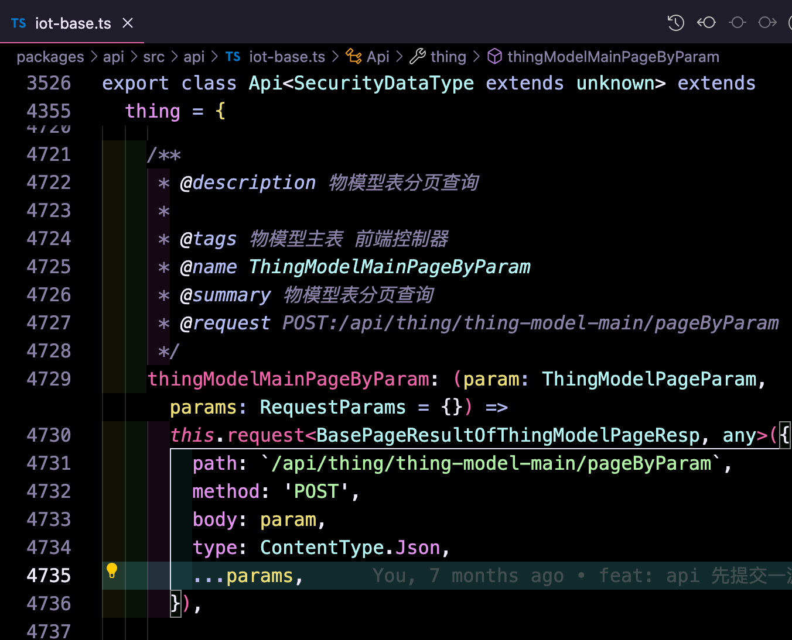

# huomu-scripts

`pnpm i @huomu/huomu-scripts`

```tsx | pure
program
  .command('build_api')
  .description('swagger 文档生成 API 方法')
  .option('-i, --input <input>', 'package.json 所在的目录，读取 package.json 中的 swaggerDocs 字段')
  .option('-o, --output <output>', '输出 /api /swagger 的目录')
  .action(buildApi);

program
  .command('build_enum')
  .description('根据枚举生成代码')
  .option('-i, --input <input>', 'enum 配置文件')
  .option('-o, --output <output>', '输出 /enum 的目录')
  .action(buildEnum);
```

## huomu-scripts build_api

生成这样的代码



经过处理暴漏 api

```tsx | pure
import { Api as IotBaseApi } from './api/iot-base';
import { injectInterceptors } from './interceptors';

const iotBaseApi = new IotBaseApi({
  baseURL: '/iot-base',
});

injectInterceptors(iotBaseApi.instance);

export { iotBaseApi };
```

业务使用

```tsx | pure
import { iotBaseApi } from '@lib/api';

iotBaseApi.thing.thingModelMainPageByParam({});
```

## huomu-scripts build_enum

后端接口会有枚举，提现在代码上是联合类型。

```tsx | pure
  /** #发布状态#ENUM#0:未发布:NOT_RELEASE,2:发布成功:RELEASED# */
  releaseStatus?: 'NOT_RELEASE' | 'RELEASED';
```

我们经常会这样的场景

```tsx | pure
// --- ReleaseStatus

export enum EnumReleaseStatus {
  NOT_RELEASE = 'NOT_RELEASE',
  RELEASED = 'RELEASED',
}

export const valueEnumReleaseStatus = {
  [EnumReleaseStatus.NOT_RELEASE]: {
    text: '未发布',
    status: 'Default',
  },

  [EnumReleaseStatus.RELEASED]: {
    text: '已发布',
    status: 'Success',
  },
};

export const listReleaseStatus = Object.keys(valueEnumReleaseStatus).map((key) => {
  const item = valueEnumReleaseStatus[key];

  return {
    value: key,
    label: item.text,
  };
});

export function TagReleaseStatus(props: { value?: EnumReleaseStatus | string }) {
  const item = props.value && valueEnumReleaseStatus[props.value];

  if (item) {
    return <Tag color={item.color}>{item.text}</Tag>;
  }

  return null;
}
```

人工写太慢，又不好通过代码生成，所以整了个脚本。脚本需要配置 enums.config.js，即可生成上面的代码

```tsx | pure
const enums = {
  ReleaseStatus: {
    NOT_RELEASE: {
      text: '未发布',
      status: 'Default',
      color: 'default',
    },
    RELEASED: {
      text: '已发布',
      status: 'Success',
      color: 'success',
    },
  },
};
```
